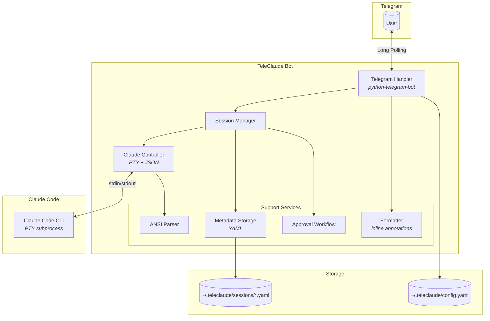
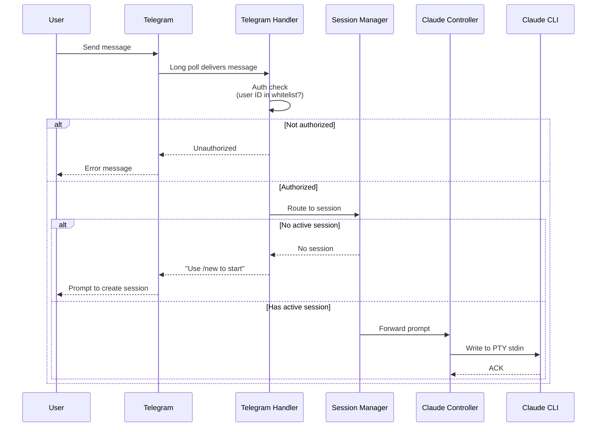
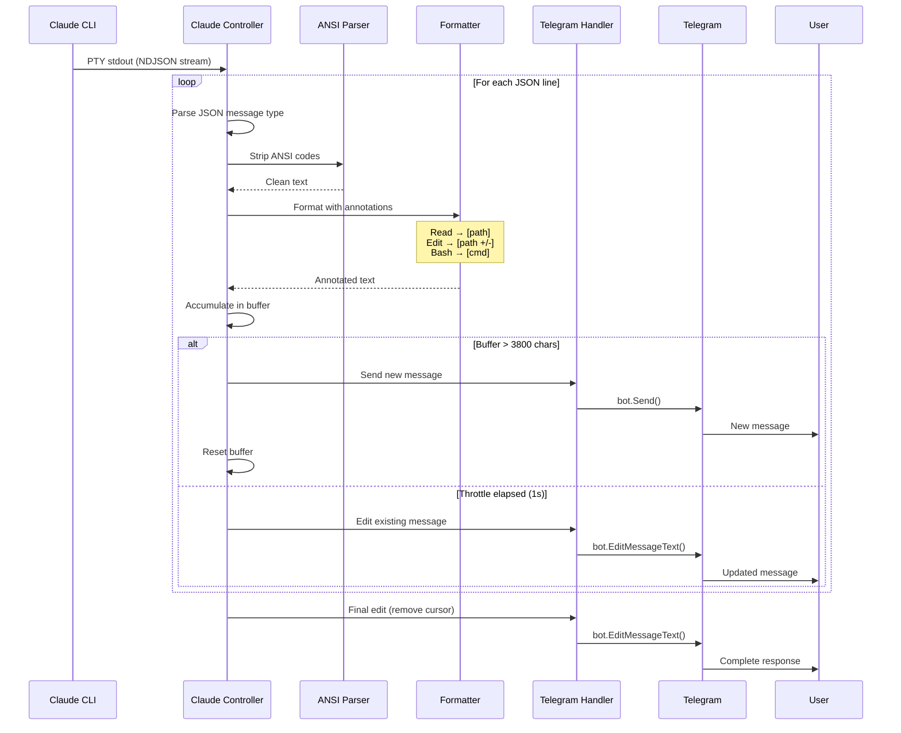
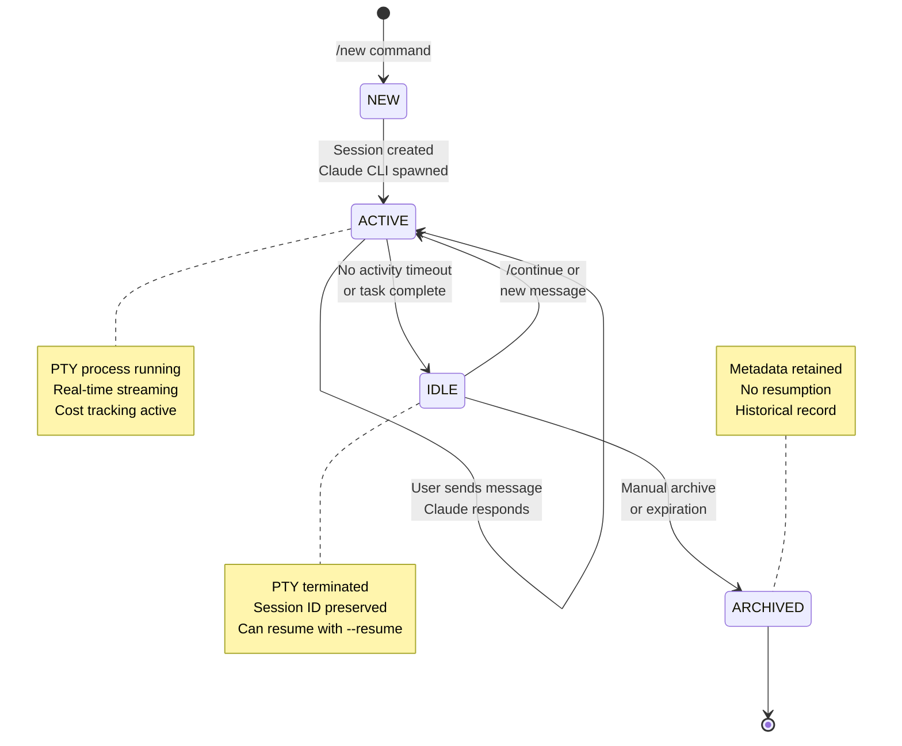

# TeleClaude

A Telegram bot for interacting with Claude Code from your mobile device.

Successor to [RichardAtCT/claude-code-telegram](https://github.com/RichardAtCT/claude-code-telegram) using the Claude Agent SDK.

## Architecture Overview



## Message Flow

### Inbound (User → Claude)



### Outbound (Claude → Telegram)



## Session Lifecycle



## Features

- Real-time streaming of Claude responses
- Session management with resume support
- Category-based approval for dangerous operations
- Cost tracking per session
- Multi-project support
- Directory navigation commands
- Git integration

## Requirements

- Python 3.10+
- Claude Code CLI installed
- Telegram Bot Token

## Installation

```bash
# Clone the repository
git clone https://github.com/user/teleclaude-python.git
cd teleclaude-python

# Install with Poetry
poetry install

# Or with pip
pip install -r requirements.txt
```

## Configuration

1. Create config directory:
```bash
mkdir -p ~/.teleclaude
```

2. Copy example config:
```bash
cp config.example.yaml ~/.teleclaude/config.yaml
```

3. Edit `~/.teleclaude/config.yaml`:
```yaml
allowed_users:
  - YOUR_TELEGRAM_USER_ID

projects:
  myapp: /path/to/your/project
```

4. Set environment variables:
```bash
export TELEGRAM_BOT_TOKEN=your_bot_token_here
```

## Usage

```bash
# Run with Poetry
poetry run python -m src.main

# Or directly
python -m src.main
```

## Commands

| Command | Description |
|---------|-------------|
| `/start` | Welcome message |
| `/help` | Show all commands |
| `/new [project]` | Start new session |
| `/continue` | Resume last session |
| `/sessions` | List all sessions |
| `/switch <id>` | Switch to session |
| `/cost` | Show usage costs |
| `/cancel` | Stop operation |
| `/cd <path>` | Change directory |
| `/ls [path]` | List directory |
| `/pwd` | Show current directory |
| `/git [cmd]` | Git operations |
| `/export [fmt]` | Export session |

## Inline Annotations

| Icon | Tool | Format |
|------|------|--------|
| 📁 | Read | `[📁 path]` |
| 📝 | Edit/Write | `[📝 path +add/-del]` |
| ⚡ | Bash | `[⚡ command]` |
| 🔍 | Grep/Glob | `[🔍 pattern]` |
| 🌐 | WebFetch | `[🌐 domain]` |

## Development

```bash
# Install dev dependencies
pip install -r requirements-dev.txt

# Run tests
pytest

# Run linting
ruff check .

# Run type checking
mypy src/
```

## License

MIT
