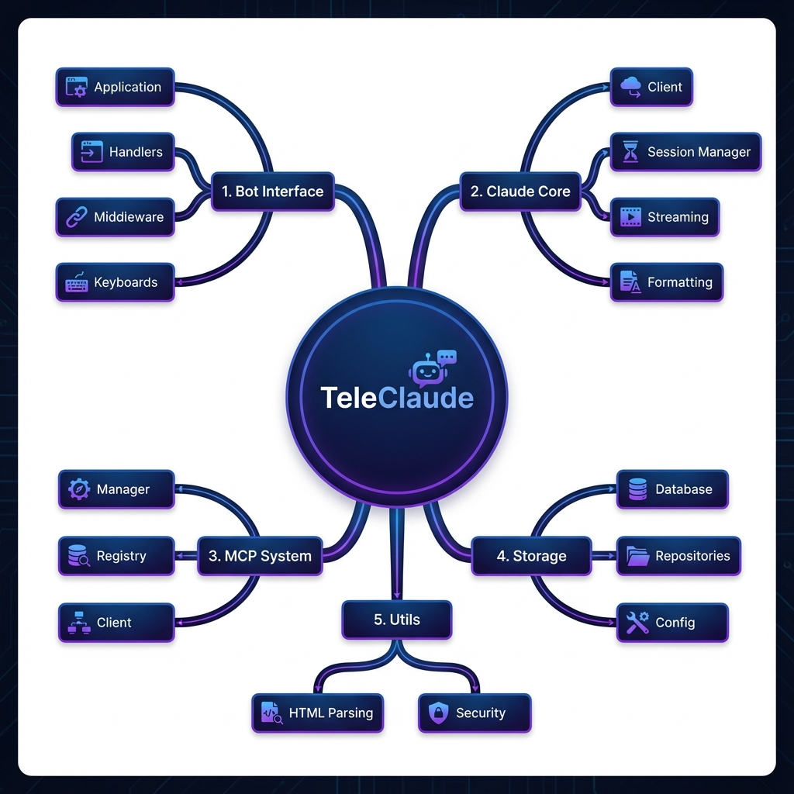
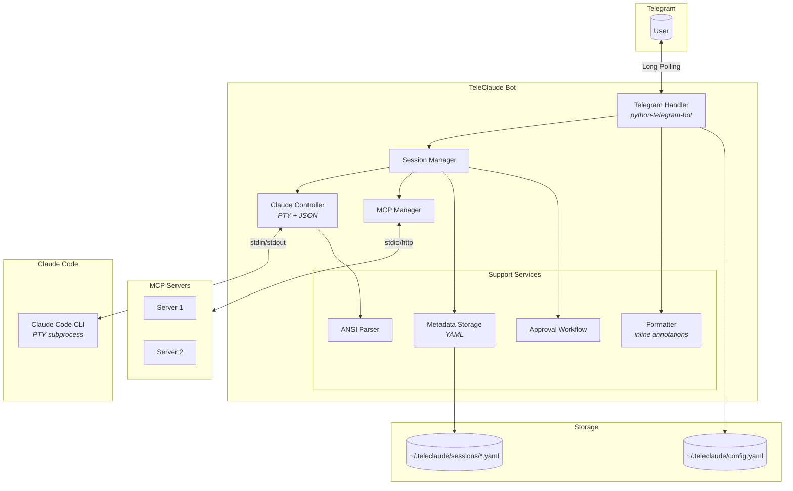
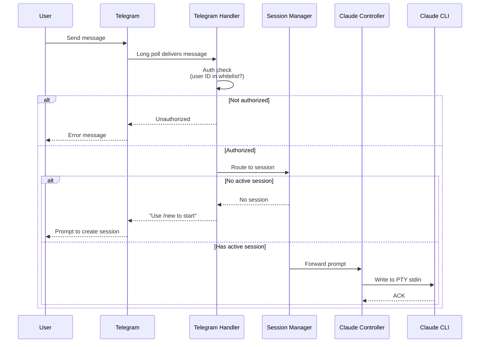
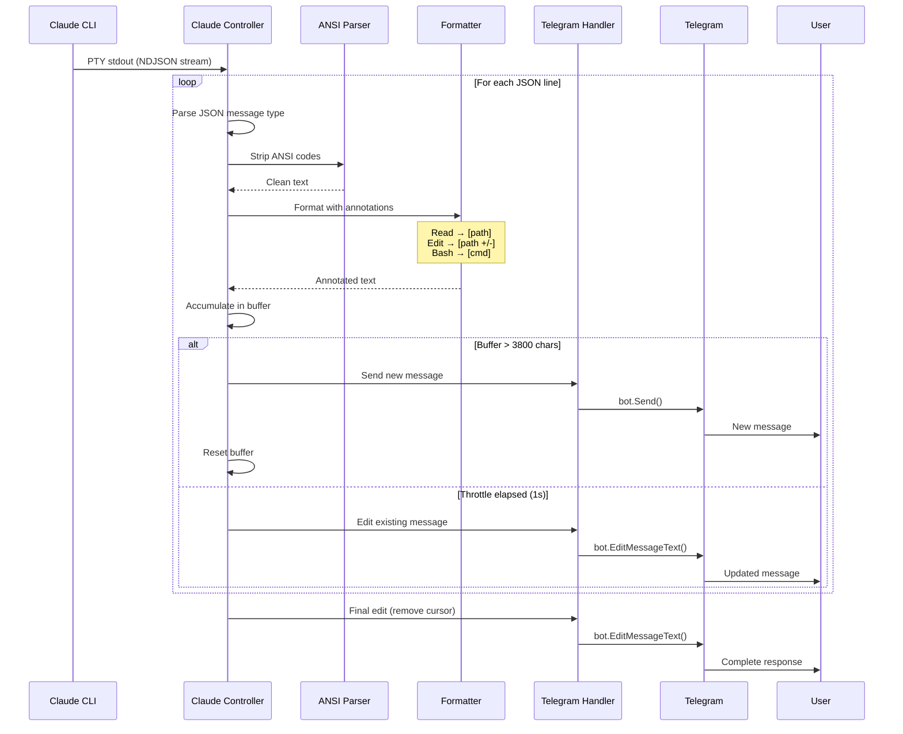
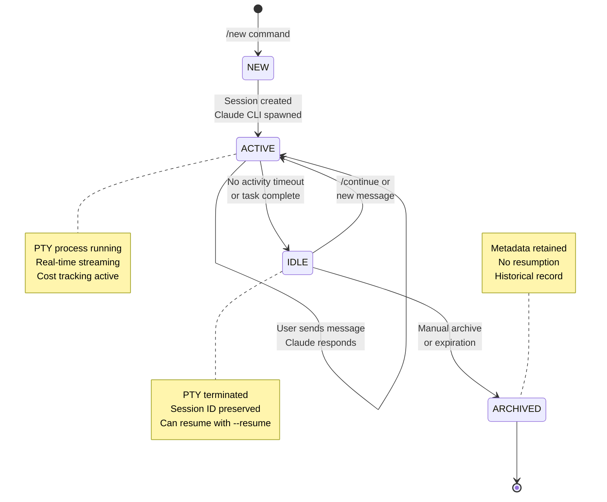

# TeleClaude


A personal Telegram bot that brings Claude Code's agentic coding capabilities to your phone. Chat with Claude to write code, edit files, run commands, and manage projects — all from Telegram with real-time streaming responses.

> [!NOTE]
> This bot was written fully using the **Claude Agents Python SDK**.

## Architecture Overview

The following mind map provides a high-level breakdown of the bot's internal components:



The system data flow and component interaction are illustrated below:




## Message Flow

### Inbound (User → Claude)



### Outbound (Claude → Telegram)



## Session Lifecycle



## Features

- Real-time streaming of Claude responses
- Session management with resume support
- Category-based approval for dangerous operations
- Cost tracking per session
- Multi-project support
- Directory navigation commands
- Git integration
- **MCP Support**: Manage and use Model Context Protocol servers
- **Dynamic Commands**: Automatically discovers Claude commands

## Getting Started

### Prerequisites

- Python 3.10+
- [Claude Code CLI](https://docs.anthropic.com/en/docs/claude-code) installed and authenticated
- Telegram account

### Step 1: Create a Telegram Bot

1. Open Telegram and search for [@BotFather](https://t.me/BotFather)
2. Send `/newbot` and follow the prompts:
   - Enter a display name (e.g., "My TeleClaude")
   - Enter a username ending with `_bot` (e.g., `my_teleclaude_bot`)
3. Copy the **HTTP API token** (looks like `123456789:ABCdefGHI...`)

### Step 2: Get Your Telegram User ID

1. Open Telegram and search for [@userinfobot](https://t.me/userinfobot)
2. Send `/start` — it will reply with your user ID
3. Copy the numeric ID (e.g., `123456789`)

### Step 3: Install

```bash
git clone https://github.com/dpolishuk/teleclaude.git
cd teleclaude
pip install -r requirements.txt
```

### Step 4: Configure

```bash
mkdir -p ~/.teleclaude
cp config.example.yaml ~/.teleclaude/config.yaml
```

Edit `~/.teleclaude/config.yaml`:

```yaml
allowed_users:
  - YOUR_TELEGRAM_USER_ID  # from Step 2

projects:
  myproject: /path/to/your/project
```

Set the bot token:

```bash
export TELEGRAM_BOT_TOKEN="your_token_here"  # from Step 1
```

### Step 5: Run

```bash
python -m src.main
```

Open your bot in Telegram and send `/start`.

## Commands

| Command | Description |
|---------|-------------|
| `/start` | Welcome message |
| `/help` | Show all commands |
| `/new [project]` | Start new session |
| `/continue` | Resume last session |
| `/sessions` | List all sessions |
| `/switch <id>` | Switch to session |
| `/cost` | Show usage costs |
| `/cancel` | Stop operation |
| `/cd <path>` | Change directory |
| `/ls [path]` | List directory |
| `/pwd` | Show current directory |
| `/git [cmd]` | Git operations |
| `/export [fmt]` | Export session |
| `/models` | Select Claude model |
| `/refresh` | Rescan Claude commands |
| `/mcp` | Manage MCP servers |

## MCP Support

TeleClaude supports the [Model Context Protocol (MCP)](https://modelcontextprotocol.io), allowing you to connect external tools and data sources.

### Configuration

Create a file at `~/.teleclaude/.mcp.json` (or `~/.mcp.json`) with your server definitions:

```json
{
  "mcpServers": {
    "filesystem": {
      "type": "stdio",
      "command": "npx",
      "args": ["-y", "@modelcontextprotocol/server-filesystem", "/path/to/allowed/dir"]
    },
    "git": {
      "type": "stdio",
      "command": "uvx",
      "args": ["mcp-server-git", "--repository", "/path/to/repo"]
    },
    "remote-server": {
      "type": "http",
      "url": "https://mcp.example.com/sse",
      "headers": {
        "Authorization": "Bearer token"
      }
    }
  }
}
```

### Management

Use the `/mcp` command to view server status:
- **Online** (🟢): Connected and ready
- **Offline** (🔴): Not connected or crashed
- **Error** (⚠️): Configuration or connection error

You can also specify a custom config path in `config.yaml`:

```yaml
mcp:
  config_path: "/path/to/my-mcp-config.json"
  auto_load: true
```

## Inline Annotations

| Icon | Tool | Format |
|------|--------|--------|
| 📁 | Read | `[📁 path]` |
| 📝 | Edit/Write | `[📝 path +add/-del]` |
| ⚡ | Bash | `[⚡ command]` |
| 🔍 | Grep/Glob | `[🔍 pattern]` |
| 🌐 | WebFetch | `[🌐 domain]` |

## Development

```bash
# Install dev dependencies
pip install -r requirements-dev.txt

# Run tests
pytest

# Run linting
ruff check .

# Run type checking
mypy src/
```

## License

MIT
